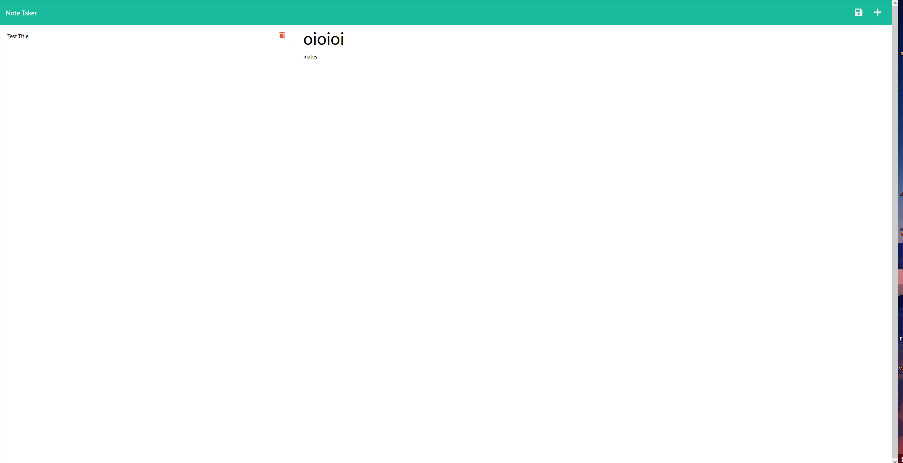

# note-taker
  
  
  ## Description:  
  This project is Note Taker. It allows the user to write down things in a notepad style app!
    app https://fierce-journey-74830.herokuapp.com/notes
    github https://github.com/rEEEEEahn/note-taker
  ## Installation:  
  1. go to the Github repo.
  2. Clone the repo. 
  3. install the dependencies.
  4. Run with: node server.js in the terminal.
    Once you click start, you can write whatever you need and then save it using the save button!
  

  ## Usage:  
  Go to the site page,or localhost:3000 if running locally.
  ## License:  
  Licensed under [MIT](./LICENSE)

  
